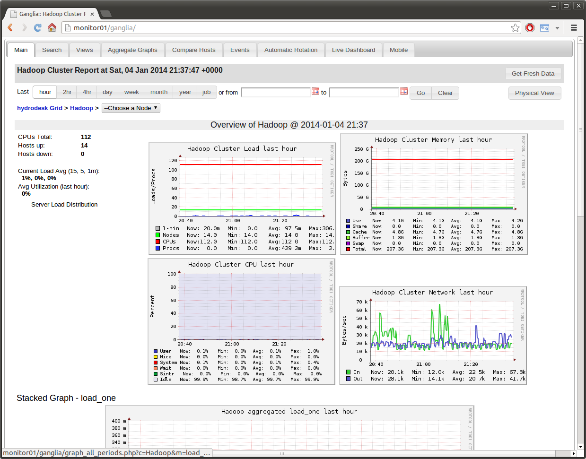

Hadoop (CDH) Ansible Playbook
=============================

This [Ansible](http://www.ansibleworks.com/) Playbook installs a [Hadoop](http://hadoop.apache.org/) (YARN)
and [HBase](http://hbase.apache.org/) cluster (running on Java 7, supported from [CDH 4.4](http://www.cloudera.com/content/cloudera-content/cloudera-docs/CDH4/latest/CDH4-Release-Notes/Whats_New_in_4-4.html)), together
with [Ganglia](http://ganglia.sourceforge.net/), [Fluentd](http://fluentd.org/), [ElasticSearch](http://www.elasticsearch.org/)
and [Kibana3](http://three.kibana.org/) for monitoring and centralized log indexing.

Follow [@analytically](http://twitter.com/analytically) for updates.

## Requirements

  - Ansible 1.3+
  - Ubuntu nodes (currently only tested on 13.04)
  - `ansibler` user in sudo group without sudo password prompt (see Bootstrap section below)

### Cloudera ([CDH 4.4](http://www.cloudera.com/content/support/en/documentation/cdh4-documentation/cdh4-documentation-v4-latest.html)) Hadoop Roles

  - [`cdh_common`](roles/cdh_common/) - sets up Cloudera's Ubuntu repository and key
  - [`cdh_hadoop_common`](roles/cdh_hadoop_cmmon/) - common packages shared by all Hadoop/HBase nodes
  - [`cdh_hadoop_config`](roles/cdh_hadoop_config/) - common configuration shared by all Hadoop nodes
  - [`cdh_hbase_config`](roles/cdh_hbase_config/) - common configuration shared by all HBase nodes
  - [`cdh_hadoop_datanode`](roles/cdh_hadoop_datanode/) - installs Hadoop DataNode
  - [`cdh_hadoop_journalnode`](roles/cdh_hadoop_journalnode/) - installs Hadoop JournalNode
  - [`cdh_hadoop_mapreduce`](roles/cdh_hadoop_mapreduce/) - installs Hadoop MapReduce
  - [`cdh_hadoop_mapreduce_historyserver`](roles/cdh_hadoop_mapreduce_historyserver/) - installs Hadoop MapReduce history server
  - [`cdh_hadoop_namenode`](roles/cdh_hadoop_namenode/) - installs Hadoop NameNode
  - [`cdh_hadoop_yarn_nodemanager`](roles/cdh_hadoop_yarn_nodemanager/) - installs Hadoop YARN node manager
  - [`cdh_hadoop_yarn_proxyserver`](roles/cdh_hadoop_yarn_proxyserver/) - installs Hadoop YARN proxy server
  - [`cdh_hadoop_yarn_resourcemanager`](roles/cdh_hadoop_yarn_resourcemanager/) - installs Hadoop YARN resource manager
  - [`cdh_hadoop_zkfc`](roles/cdh_hadoop_zkfc/) - installs Hadoop Zookeeper Failover Controller
  - [`cdh_hbase_master`](roles/cdh_hbase_master/) - installs HBase-Master
  - [`cdh_hbase_regionserver`](roles/cdh_hbase_regionserver/) - installs HBase RegionServer
  - [`cdh_zookeeper_server`](roles/cdh_zookeeper_server/) - installs ZooKeeper Server

## Configure

Make sure you customize the following files:

- [`group_vars/all`](group_vars/all) - site_name and notify_email
- [`roles/postfix_mandrill/defaults/main.yml`](roles/postfix_mandrill/defaults/main.yml) - set your [Mandrill](http://mandrill.com/) account (API key)
- [`roles/cdh_hadoop_config/defaults/main.yml`](roles/cdh_hadoop_config/defaults/main.yml) - Hadoop settings

## Running on JDK 1.6 instead

In [`roles/oab_java/tasks/main.yml`](roles/oab_java/tasks/main.yml) remove `-7` from `script: oab-java.sh -s -7`. This
will then install the latest Oracle JDK 1.6 release.

## Install Hadoop

To run Ansible:

```
site.sh
```

To e.g. just install ZooKeeper (available tags: apache,configuration,elasticsearch,fluentd,ganglia,hadoop,hannibal,hbase,java,kibana,ntp,rsyslog,tdagent,zookeeper):

```
site.sh zookeeper
```

## Bootstrapping

Paste your public SSH RSA key in `bootstrap/ansible_rsa.pub` and run `bootstrap.sh` to bootstrap the nodes
specified in `bootstrap/hosts`. See [`bootstrap/bootstrap.yml`](bootstrap/bootstrap.yml) for more information.

## Screenshots





### License

Licensed under the [Apache License, Version 2.0](http://www.apache.org/licenses/LICENSE-2.0).

Copyright 2013 [Mathias Bogaert](mailto:mathias.bogaert@gmail.com).